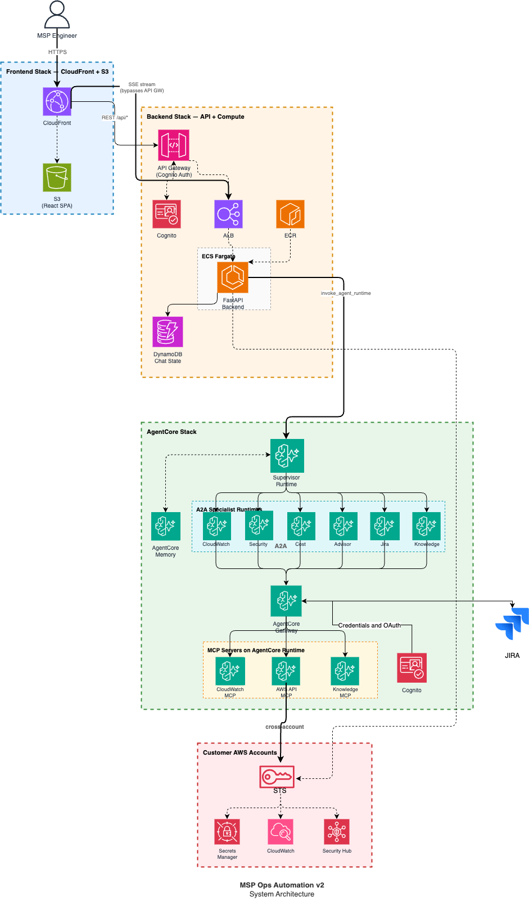
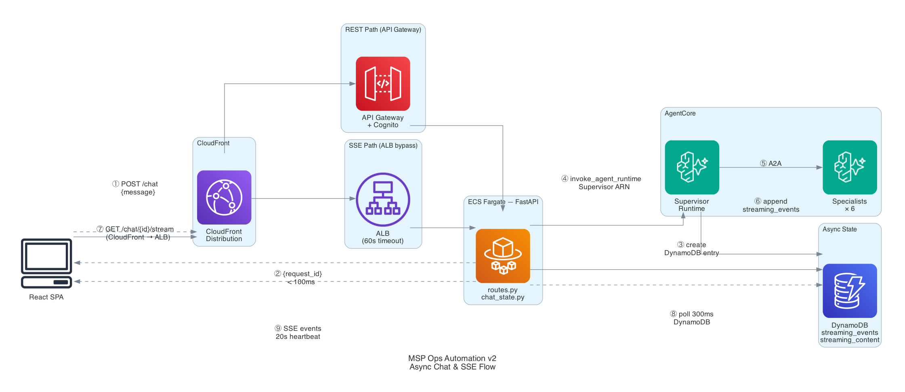
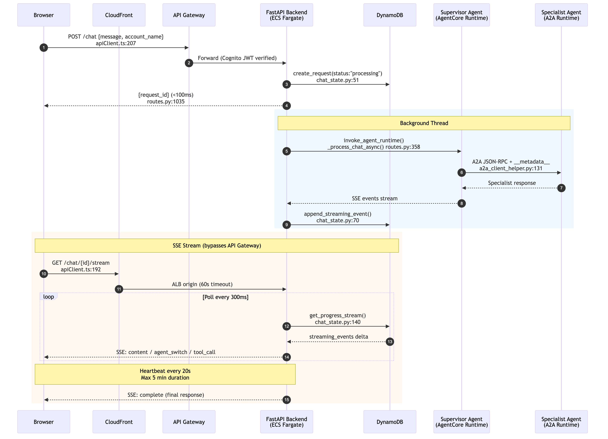
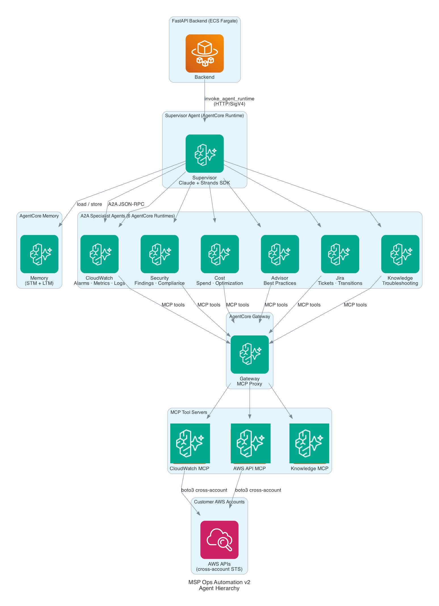
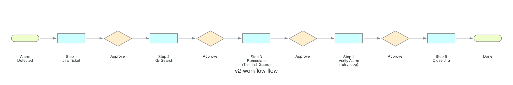
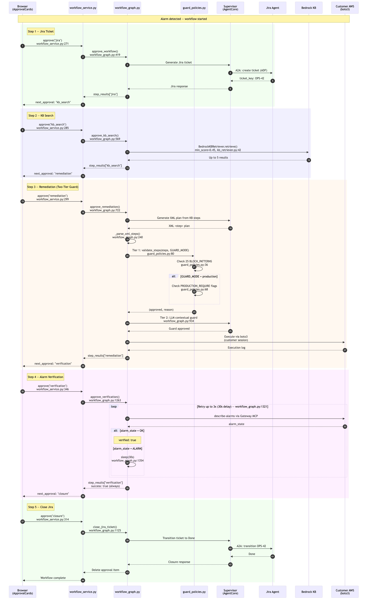
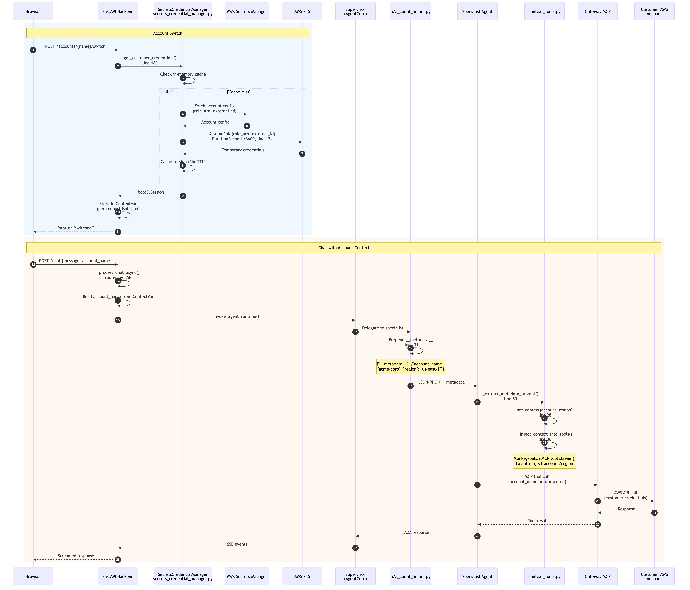

# MSP Operations Automation — Powered by Amazon Bedrock AgentCore

> **Note:** This is a sample application intended for demonstration purposes only. It is not intended for production use without further review and hardening.

This solution deploys an AI-powered AWS operations assistant for Managed Service Providers (MSPs)
using Amazon Bedrock AgentCore. It enables MSPs to manage multiple customer AWS accounts through a
natural language chat interface with automated alarm remediation workflows.

The application uses a multi-agent architecture where a Supervisor agent orchestrates 6 specialist
agents (CloudWatch, Security Hub, Cost Explorer, Trusted Advisor, Jira, Knowledge Base) running as
independent serverless runtimes on Amazon Bedrock AgentCore. All agent communication uses the
Agent-to-Agent (A2A) protocol, and tools are accessed through an AgentCore Gateway using the Model
Context Protocol (MCP).

## Architecture

The solution consists of a React frontend served via Amazon CloudFront, a FastAPI backend running on
Amazon ECS Fargate, and 10 agent runtimes deployed on Amazon Bedrock AgentCore (1 Supervisor + 6 A2A
specialists + 3 MCP servers). Customer account access is managed through AWS STS cross-account role
assumption with credentials stored in AWS Secrets Manager.



### How Chat Works

When a user sends a message, the backend returns a `request_id` immediately (under 100ms) and
processes the AI request asynchronously. A background thread invokes the Supervisor agent on
AgentCore, which routes the query to the appropriate specialist via A2A. Streaming events are
written to DynamoDB, and the frontend reads them via an SSE stream that bypasses API Gateway
through a dedicated CloudFront-to-ALB path — avoiding the 29-second timeout.





### Agent Hierarchy

The Supervisor agent never calls AWS APIs directly. It delegates every query to one of six
specialist agents, each running as an independent AgentCore Runtime. Specialists connect to
AWS services through an AgentCore Gateway that proxies three MCP tool servers.



### Alarm Remediation Workflow

When the CloudWatch agent detects an active alarm, the system initiates a 5-step remediation
workflow. Each step requires human approval (or runs automatically in Full Automation mode):
Jira ticket creation, Knowledge Base search for a remediation plan, Guard-validated execution,
alarm verification with retry loop, and Jira ticket closure.



Remediation plans pass through a two-tier Guard before execution. Tier 1 is a deterministic
regex blocklist (25 patterns) that instantly rejects dangerous CLI commands at zero LLM cost.
Tier 2 is an LLM contextual guard that evaluates whether the plan is appropriate for the
specific alarm context. The `GUARD_MODE` environment variable controls strictness (`demo` vs
`production`).



### Cross-Account Session Propagation

Customer account context travels from the backend through the Supervisor to each specialist
via a `__metadata__` JSON prefix prepended to every A2A message. Specialists strip the prefix
and auto-inject `account_name`/`region` into every MCP tool call.



### Components

| Component | Technology | Description |
|-----------|-----------|-------------|
| Frontend | React 18, TypeScript, CloudScape Design, Zustand | Single-page application with chat interface, account management, workflow approvals |
| Backend | FastAPI, Python 3.11, ECS Fargate | Thin orchestration layer — invokes AgentCore Runtime, manages async chat state in DynamoDB |
| Supervisor Agent | Strands Agents SDK, HTTP protocol | Routes queries to specialist agents, manages conversation memory |
| CloudWatch Agent | Strands Agents SDK, A2A protocol | Monitors alarms, metrics, and logs across customer accounts |
| Security Agent | Strands Agents SDK, A2A protocol | Analyzes Security Hub findings and compliance status |
| Cost Agent | Strands Agents SDK, A2A protocol | Provides Cost Explorer analysis with natural language date parsing |
| Advisor Agent | Strands Agents SDK, A2A protocol | Retrieves Trusted Advisor recommendations |
| Jira Agent | Strands Agents SDK, A2A protocol | Creates, updates, and transitions Jira tickets |
| Knowledge Agent | Strands Agents SDK, A2A protocol | Searches Bedrock Knowledge Base for troubleshooting guides |
| MCP Servers | awslabs CloudWatch MCP, awslabs AWS API MCP, AWS Knowledge MCP | Tool servers providing AWS API access through AgentCore Gateway |
| Infrastructure | AWS CDK (Python), 3 stacks | AgentCore resources, ECS/ALB/API Gateway/Cognito, CloudFront/S3 |

### Key Features

- **Multi-Account Management** — Manage multiple customer AWS accounts with cross-account STS and ExternalId
- **AI-Powered Chat** — Natural language queries routed to domain-specific specialist agents
- **Real-time SSE Streaming** — Token-by-token streaming via CloudFront to ALB bypass (no API Gateway buffering)
- **Workflow Automation** — 5-step alarm remediation (Jira, KB Search, Remediate, Verify Alarm, Close) with approval gates
- **Full Automation Mode** — Execute all workflow steps automatically after single confirmation
- **Conversation Memory** — AgentCore Memory with semantic and summary strategies for context continuity
- **Health Monitoring** — AWS Health Dashboard integration for outages, maintenance, and notifications

## Project Structure

```
sample-MSP-Ops-Automation/
├── agents/
│   ├── runtime/                 # Supervisor agent (Strands SDK, A2A tools)
│   ├── runtime_cloudwatch/      # CloudWatch specialist
│   ├── runtime_security/        # Security Hub specialist
│   ├── runtime_cost/            # Cost Explorer specialist (+ date parser)
│   ├── runtime_advisor/         # Trusted Advisor specialist
│   ├── runtime_jira/            # Jira specialist
│   └── runtime_knowledge/       # Bedrock KB specialist
├── backend/
│   └── app/
│       ├── api/routes.py        # All API endpoints (chat, workflow, accounts, health)
│       ├── core/                # auth, account_manager, config, secrets_credential_manager
│       └── services/            # chat_state, workflow_service, workflow_graph, kb_retriever
├── frontend/
│   └── src/
│       ├── pages/               # MainAppPage, SignInPage
│       ├── components/          # WorkflowPanel, ApprovalCards, WorkflowProgress
│       ├── services/api/        # apiClient.ts (SSE + poll)
│       ├── services/auth/       # cognitoService.ts
│       └── store/               # workflowStore, accountStore
├── infrastructure/
│   └── cdk/
│       ├── app.py               # CDK app — chains 3 stacks
│       └── stacks/
│           ├── agentcore_stack.py   # Memory + Gateway
│           ├── backend_stack.py     # ECS + ALB + API GW + DynamoDB + Cognito
│           └── frontend_stack.py    # S3 + CloudFront (dual-origin SSE bypass)
├── scripts/                     # Operational scripts (sync-runbooks.py)
├── diagrams/          # Architecture diagrams (v2-*.png)
├── misc/                        # Demo CloudFormation stack + testing scripts
├── deploy.sh                    # 13-step automated deployment
└── destroy.sh                   # 9-step ordered teardown
```

## Prerequisites

Before deploying, ensure the following tools are installed and configured:

| Tool | Minimum Version | Install | Validation |
|------|----------------|---------|------------|
| AWS CLI | **v2.33.8+** | `brew upgrade awscli` | `aws bedrock-agentcore-control help` |
| Docker | Latest | [docs.docker.com](https://docs.docker.com/get-docker/) | `docker --version` |
| Node.js | v18+ | `brew install node` | `node --version` |
| Python | 3.11.x | `pyenv install 3.11.13` | `python3 --version` |
| AWS CDK | v2.120+ | `npm install -g aws-cdk` | `cdk --version` |
| AgentCore CLI | Latest | `pip install bedrock-agentcore-starter-toolkit` | `agentcore --version` |

> **Important:** AWS CLI v2.33.8+ is required. The `bedrock-agentcore-control` commands were added in this version. If you see "Invalid choice" error, update your CLI.

You also need:
- AWS credentials configured (`aws sts get-caller-identity` must succeed)
- Bedrock model access enabled for Claude Sonnet in your region
- A Jira Cloud instance with an [API token](https://id.atlassian.com/manage-profile/security/api-tokens)

## Deployment

### 1. Clone the Repository

```bash
git clone https://github.com/aws-samples/sample-msp-ops-automation.git
cd sample-msp-ops-automation
```

### 2. Configure Environment Variables

Copy the example configuration and fill in the required values:

```bash
cp backend/.env.example backend/.env
```

#### Jira Integration (Required)

| Variable | How to Get | Example |
|----------|-----------|---------|
| `JIRA_DOMAIN` | Your Jira instance URL (without trailing slash) | `https://mycompany.atlassian.net` |
| `JIRA_EMAIL` | Your Atlassian account email | `admin@company.com` |
| `JIRA_API_TOKEN` | [Create API token](https://id.atlassian.com/manage-profile/security/api-tokens) — name it "MSP Assistant" | `ATATT3xFfGF0...` |
| `JIRA_PROJECT_KEY` | From your Jira project URL (e.g., `OPS` from `browse/OPS-123`) | `OPS` |

#### Bedrock Model (Required — has default)

| Variable | How to Get | Example |
|----------|-----------|---------|
| `MODEL` | Enable "Claude Sonnet 4" in [Bedrock Console](https://console.aws.amazon.com/bedrock/home#/modelaccess) | `global.anthropic.claude-sonnet-4-20250514-v1:0` |

#### Optional Features

| Variable | How to Get | When to Use |
|----------|-----------|-------------|
| `BEDROCK_KNOWLEDGE_BASE_ID` | Create a [Bedrock Knowledge Base](https://docs.aws.amazon.com/bedrock/latest/userguide/knowledge-base.html) and upload troubleshooting docs | Enable KB-driven remediation in workflows |
| `UNRESOLVED_TICKET_EMAIL` | Your notification email | Get alerts for unresolved tickets |

Auto-populated variables (`SUPERVISOR_RUNTIME_ARN`, `MEMORY_ID`, `GATEWAY_ARN`, `GATEWAY_URL`, `COGNITO_USER_POOL_ID`, `COGNITO_CLIENT_ID`, `FRONTEND_URL`) are written automatically by `deploy.sh` — do not edit these.

### 3. Deploy

```bash
./deploy.sh --email admin@company.com --region us-east-1
```

| Parameter | Required | Default | Description |
|-----------|----------|---------|-------------|
| `--email` | Yes | — | Email for Cognito user creation |
| `--region` | No | `us-east-1` | AWS region for deployment |

The script executes 13 automated steps (~60-90 minutes):
- Validates prerequisites and builds Docker image
- Deploys Supervisor Runtime to AgentCore (before CDK, so ARN is available)
- Deploys 3 CDK stacks (AgentCore, Backend, Frontend)
- Creates OAuth credential provider for Gateway-to-MCP authentication
- Deploys 3 MCP servers and creates AgentCore Gateway with 4 targets
- Deploys 6 A2A specialist runtimes
- Redeploys Supervisor with all specialist ARNs
- Configures IAM permissions, CORS, and creates Cognito user

### 4. Access the Application

After deployment completes, the script outputs:
```
Frontend URL: https://d1234567890.cloudfront.net
API URL: https://abc123.execute-api.us-east-1.amazonaws.com/prod
Email: admin@company.com
Temporary password: Temp1XXXXXXXXX!
```

Sign in and change your password on first login.

### Retrieving Infrastructure Values

```bash
# View all CDK outputs
cat infrastructure/cdk/outputs.json | jq

# Get specific values
jq -r '.MSPAssistantFrontendStack.FrontendURL' infrastructure/cdk/outputs.json
jq -r '.MSPAssistantBackendStack.APIURL' infrastructure/cdk/outputs.json
jq -r '.MSPAssistantBackendStack.CognitoUserPoolId' infrastructure/cdk/outputs.json
jq -r '.MSPAssistantAgentCoreStack.SupervisorRuntimeARN' infrastructure/cdk/outputs.json
jq -r '.MSPAssistantAgentCoreStack.GatewayURL' infrastructure/cdk/outputs.json
jq -r '.MSPAssistantAgentCoreStack.MemoryId' infrastructure/cdk/outputs.json
```

## Testing

### Basic Functional Testing

1. **Sign in** to the Frontend URL with your Cognito credentials
2. **Try sample questions** from the sidebar:
   - "Do I have any active alarms?"
   - "Show me my AWS spending over the last 4 months"
   - "Show me critical security findings"
   - "What are my Trusted Advisor recommendations?"
3. **Verify agent routing** — Check that responses include agent type badges (CloudWatch, Cost, Security, Advisor)

### Customer Account Testing

Test cross-account access with a simulated customer account:

1. **Add a customer account** via the UI — click "Add" in the account selector, enter a customer name, and copy the generated AWS CLI commands
2. **Run the commands** in a separate AWS account (or the same account for testing) to create the cross-account IAM role
3. **Switch to the customer account** in the UI and run queries to verify cross-account access

### Workflow Testing

The `misc/` folder contains files for setting up demo infrastructure:

| File | Description |
|------|-------------|
| `misc/CloudResourcecfn.txt` | CloudFormation template for creating test AWS resources (S3, Lambda, API Gateway, CloudWatch alarms) |
| `misc/api-gateway-add-deny-policy.py` | Utility script to add/remove deny policies on API Gateway for testing 403 error remediation workflows |

To test the full remediation workflow:

1. Deploy the CloudFormation stack in a customer account:
   ```bash
   aws cloudformation deploy \
     --template-file misc/CloudResourcecfn.txt \
     --stack-name aiops-demo \
     --capabilities CAPABILITY_NAMED_IAM
   ```

2. Add the customer account to MSP Assistant via the UI

3. Trigger a test alarm by adding a deny policy to API Gateway:
   ```bash
   cd misc && python api-gateway-add-deny-policy.py
   # Select option 1 to add DENY policy
   ```

4. Wait 1-2 minutes for the alarm to fire, then ask: **"Do I have any active alarms?"**

5. Enable Smart Workflows in the sidebar and approve each step (Jira, KB Search, Remediate, Verify, Close), or toggle Full Automation to run all steps automatically

6. Clean up: `aws cloudformation delete-stack --stack-name aiops-demo`

### Observability

View agent execution traces and logs:

```bash
# Open CloudWatch GenAI Observability console
open "https://console.aws.amazon.com/cloudwatch/home?region=us-east-1#genai-observability"

# Tail specific log groups
aws logs tail /aws/bedrock-agentcore/runtime/msp_supervisor_agent --follow
aws logs tail /aws/bedrock-agentcore/runtime/cloudwatch_a2a_runtime --follow
aws logs tail /aws/bedrock-agentcore/gateway/msp-assistant-gateway --follow
```

## Clean Up

Delete all deployed resources:

```bash
./destroy.sh --region us-east-1 --force
```

| Parameter | Default | Description |
|-----------|---------|-------------|
| `--region` | `us-east-1` | AWS region to clean up |
| `--force` | `false` | Skip confirmation prompt |
| `--keep-bootstrap` | `false` | Preserve CDKToolkit stack for future deployments |

The script removes all resources in 9 ordered steps: AgentCore resources, ECS, ALB/API Gateway, S3, ECR/Lambda/CloudWatch/Cognito/DynamoDB, Secrets Manager, VPC, CloudFormation stacks, and IAM roles. Automated verification confirms complete cleanup.

## Security

See [CONTRIBUTING](CONTRIBUTING.md#security-issue-notifications) for more information.

## License

This library is licensed under the MIT-0 License. See the [LICENSE](LICENSE) file.
